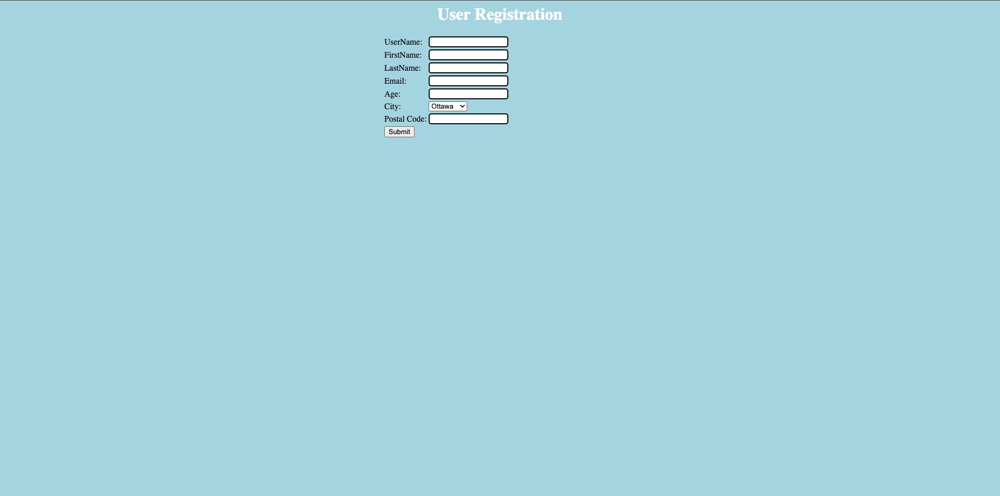
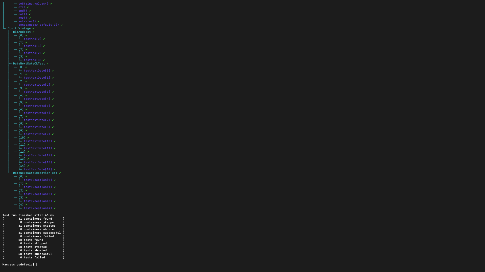

# SEG3503 — Laboratoire 2 : Classes d'Équivalence

**Étudiant :** Aubelin  
**Repo :** https://github.com/Aubelin/seg3503_playground  
**Répertoire :** `lab02/`

---

## Exercice 1 — Exécution des cas de test sur `nextDate()`

Les 20 cas de test sont définis dans le fichier de l'énoncé. Chaque cas est exécuté et le verdict est noté ci-dessous.

| Cas de Test | Input (y, m, d)   | Résultats Escomptés | Résultats Actuels | Verdict     |
|:-----------:|:-----------------:|:-------------------:|:-----------------:|:-----------:|
| TC1         | 1700, 06, 20      | 1700, 06, 21        | 1700, 06, 21      | Succès      |
| TC2         | 2005, 04, 15      | 2005, 04, 16        | 2005, 04, 16      | Succès      |
| TC3         | 1901, 07, 20      | 1901, 07, 21        | 1901, 07, 21      | Succès      |
| TC4         | 3456, 03, 27      | 3456, 03, 28        | 3456, 03, 28      | Succès      |
| TC5         | 1500, 02, 17      | 1500, 02, 18        | 1500, 02, 18      | Succès      |
| TC6         | 1700, 06, 29      | 1700, 06, 30        | 1700, 06, 30      | Succès      |
| TC7         | 1800, 11, 29      | 1800, 11, 30        | 1800, 11, 30      | Succès      |
| TC8         | 3453, 01, 29      | 3453, 01, 30        | 3453, 01, 30      | Succès      |
| TC9         | 444, 02, 29       | 444, 03, 01         | 444, 03, 01       | Succès      |
| TC10        | 2005, 04, 30      | 2005, 05, 01        | 2005, 05, 01      | Succès      |
| TC11        | 3453, 01, 30      | 3453, 01, 31        | 3453, 01, 31      | Succès      |
| TC12        | 3456, 03, 30      | 3456, 03, 31        | 3456, 03, 31      | Succès      |
| TC13        | 1901, 07, 31      | 1901, 08, 01        | 1901, 08, 01      | Succès      |
| TC14        | 3453, 01, 31      | 3453, 02, 01        | 3453, 02, 01      | Succès      |
| TC15        | 3456, 12, 31      | 3457, 01, 01        | 3457, 01, 01      | Succès      |
| TC16        | 1500, 02, 31      | IllegalArgumentException | IllegalArgumentException | Succès |
| TC17        | 1500, 02, 29      | IllegalArgumentException | IllegalArgumentException | Succès |
| TC18        | -1, 10, 20        | IllegalArgumentException | IllegalArgumentException | Succès |
| TC19        | 1458, 15, 12      | IllegalArgumentException | IllegalArgumentException | Succès |
| TC20        | 1975, 06, -50     | IllegalArgumentException | IllegalArgumentException | Succès |

**Résultat : 20/20 Succès**

Screenshot de l'application web (`http://localhost:8080`) :



Screenshot de l'exécution des tests :



---

## Exercice 2 — Tests JUnit automatisés

### Structure des fichiers de test

```
lab02/ecs/test/
├── BitTest.java                  — Tests JUnit 5 explicites pour Bit (fourni)
├── BitAndTest.java               — Tests JUnit 4 paramétrés pour Bit.and() (fourni)
├── DateTest.java                 — Tests JUnit 5 explicites pour nextDate() (20 cas)
├── DateNextDateOkTest.java       — Tests JUnit 4 paramétrés : TC1–TC15 (résultats valides)
└── DateNextDateExceptionTest.java — Tests JUnit 4 paramétrés : TC16–TC20 (exceptions)
```

### DateTest.java (JUnit 5 — tests explicites)

20 méthodes `@Test` individuelles, une par cas de test. Les TC1–TC15 utilisent `assertEquals` pour comparer la date du lendemain. Les TC16–TC20 utilisent `assertThrows` pour vérifier que `IllegalArgumentException` est levée lors de la construction d'une date invalide.

### DateNextDateOkTest.java (JUnit 4 — Parameterized Runner)

Utilise `@RunWith(Parameterized.class)` sur le modèle de `BitAndTest.java`. Contient 15 jeux de données (TC1–TC15) sous la forme `{year, month, day, expectedYear, expectedMonth, expectedDay}`. Une seule méthode `testNextDate()` est exécutée pour chaque combinaison.

### DateNextDateExceptionTest.java (JUnit 4 — Parameterized Runner)

Même pattern paramétré avec 5 jeux de données (TC16–TC20). La méthode `testException()` est annotée `@Test(expected = IllegalArgumentException.class)` et tente de construire une `Date` invalide.

### Résultats d'exécution

```
Test run finished after 49 ms
[        31 containers found      ]
[        31 containers started    ]
[        31 containers successful ]
[         0 containers failed     ]
[        58 tests found           ]
[        58 tests started         ]
[        58 tests successful      ]
[         0 tests failed          ]
```


